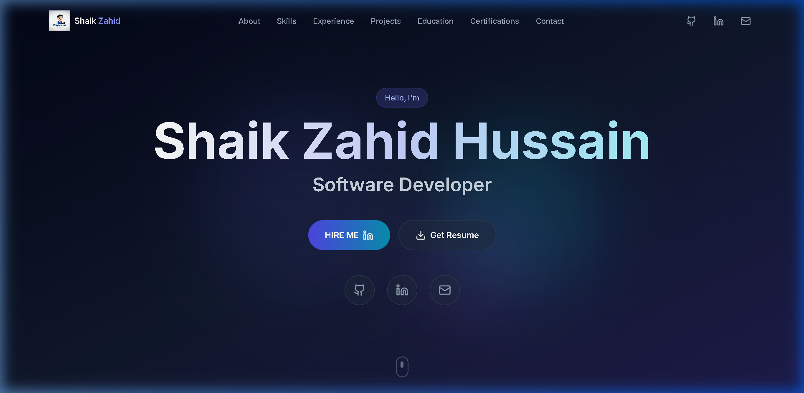
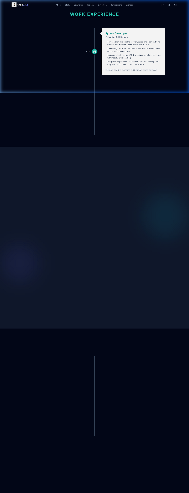
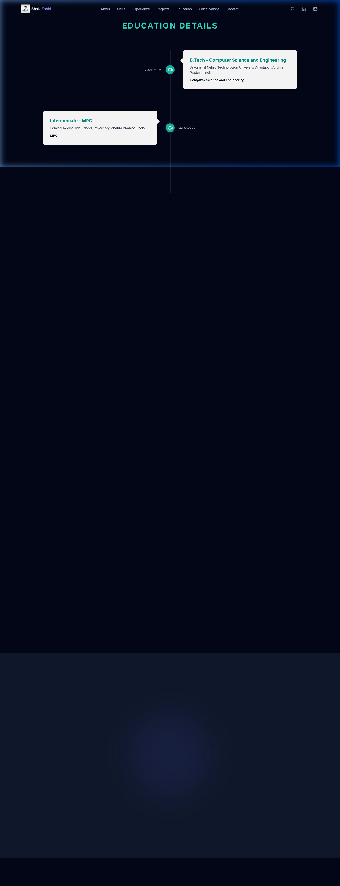

# Professional Developer Portfolio - Shaik Zahid Hussain

This is a modern, responsive, and high-fidelity developer portfolio built with React, TypeScript, Tailwind CSS, and Framer Motion. It showcases engineering depth, technical skills, and a results-oriented approach to software development.

## 🚀 Key Features

- **Modern UI/UX**: Premium dark theme with sleek gradients and smooth micro-animations.
- **Vertical Roadmaps**: High-fidelity timeline layouts for Education and Work Experience.
- **Visual Projects Gallery**: Responsive grid with project thumbnails, detailed case studies, and direct links to GitHub and Live demos.
- **Visual Certifications**: A dedicated grid for showcasing industry certifications and internships.
- **Mobile Responsive**: Fully optimized for all screen sizes from mobile devices to desktop monitors.

## 📸 Portfolio Preview

### Hero Section


### About Me


### Technical Skills


### Work Experience Roadmap


### Featured Projects


### Education Roadmap


### Certifications & Internships


## 🛠️ Tech Stack

- **Frontend**: React.js, TypeScript
- **Styling**: Tailwind CSS, Lucide React (Icons)
- **Animations**: Framer Motion
- **Hosting**: Render / Vercel

## 🏗️ Getting Started

### Prerequisites
- Node.js (v18+)
- npm or pnpm

### Installation
1. Clone the repository:
   ```bash
   git clone https://github.com/Zahid-Hussain-Shaik/portfolio.git
   ```
2. Install dependencies:
   ```bash
   npm install
   ```
3. Start the development server:
   ```bash
   npm run dev
   ```

## 📝 License

Distributed under the MIT License. See `LICENSE` for more information.

---
© 2026 Shaik Zahid Hussain.
